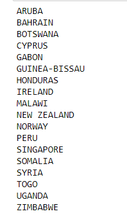
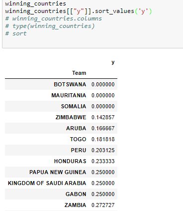
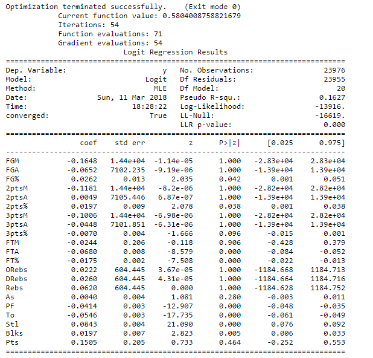

# UTSPANHacks

# Motivation/Preamble:

I wanted to "just" "apply machine learning" to the data problem posted at the UTSPANHacks at U of T this past weekend (March 10-11). I had an idea/conviction in mind that you could just "run a regression" on the data, and perhaps get useful insights out. Turns out, this is more or less true, but just to prepare the data to pass into the module so that you can tell `scikit learn` or `Tensorflow` to do the regression, is a feat in and of itself. 

# "Data Engineering"

Hence, I spent most of the time just getting the data into the form I wanted. The simple task of putting a win/loss column to the Boxscores csv took 40%+ of my "dev" time, and I only solved it by rejecting `pandas` and just resorting to my good old file handling skills in pure python (PP). Once that was finally done, I spent some time on using One-Hot-Encoding (for the country names) to ensure the logistic regression could be done. (note that RFE cannot be done with these string categorical variables). After that I tried doing Recursive Feature Elimination to see which set of variables to run the regression on, but it gave me very weird results (country names, instead of actual game stats):

*These are the most significant features, according to RFE:*



An analysis of the best and worst performing countries by win rate:



*A posteori*, we can see that RFE probably picked those variables because they are highly winning or highly losing teams. Obviously however, there is no causal reason for why the country name determine the game outcome, and we are simply looking at correlation here. 

From my statistical intuition, I thus decided to discard those variables that were selected by the RFE. Instead, I just ran the regression entirely on the original provided variables, taking out some pretty obvious variables which should not have an effect: like 'Game_ID', 'Player_ID', 'Unnamed: 0', 'Name', 'Row_ID', 'Number', "Min" etc.  

Once this was done, I was finally ready to "run" the regression:

```python
logit_model=sm.Logit(y,X) 
result=logit_model.fit_regularized()
print(result.summary())
```

As you can see, the regression is just three lines (and it produced nearly no issues, bar having to switch from a regular `fit` to a `fit_regularized`)

So in conclusion: too much time doing data engineering/getting the data into the right format, and not enough time actually applying/doing statistics knowledge. 


# Results

From the results: we see some basic and interesting insights:


   

As would make sense, we see that the % stats (2pts%, 3pts%) are far more important than the raw 2pts or 3pts numbers. We know this because the p-value for the z-statistic for the % stats is quite low, indicating a low probability that these numbers would occur randomly with the same game result frequently (if there truly was no correlation between variables) [pretty much, this is saying that we see frequently a high 2-point percentage occur with a win for the team, and it is unlikely that this just randomly keeps occurring]


Note there is a way of interpreting the coefficients, but I am not sure right now:

https://stats.idre.ucla.edu/other/mult-pkg/faq/general/faq-how-do-i-interpret-odds-ratios-in-logistic-regression/


Perhaps the most interesting and non-immediately obvious statistic is FT% is the most important scoring stat for a team (in this dataset). Hence, making freethrows (like in *Better luck tomorrow*) is extremely important!  

Lastly, we see that for some reason, certain "ancillary" statistics, like Steals, Blocks, Turnovers and Personal Fouls are all highly significant. Using basketball intuition, we can that certain of these variables are interrelated: steals and blocks with turnovers, and personal fouls with free throws. This suggests an interlinked set of variables that may merit more investigation. 

# Summary:

Further testing of our model demonstrates that it is "OK": the "accuracy" is 0.77 and this holds under cross-validation. 

However note that perhaps the most important part of the project, the "machine learning" and statistics is where I spent the least amount of my time (just plugging and chugging), and I don't think I have a strong enough statistical background to lend any credence to these results. 

# Next steps:

Run RFE on the non-country features (i.e. FGM, FGA and so forth...)

At the beginning of the hackathon, I had a dream of doing all the statistical methods on this project: running this data through a neural network, doing svm, or random forest on it. So that might be nice to checkout. For the neural network I was actually looking into using Java's Neuroph framework, as advocated by this IBM guide: https://www.ibm.com/developerworks/library/cc-artificial-neural-networks-neuroph-machine-learning/index.html. Note that now I understand why so much of the guide was just talking about "configuring" the neural network (and why they used a PostgreSQL database just to feed in data!) !


Overall, it was a good hackathon, and I succeeded in doing "machine learning/data science" on the problem. Thanks to UTSPAN and CBA for the food and the interesting problem! 

Learn exactly how to interpret the coefficients generated by the model:

https://stats.idre.ucla.edu/other/mult-pkg/faq/general/faq-how-do-i-interpret-odds-ratios-in-logistic-regression/


# References:

https://towardsdatascience.com/building-a-logistic-regression-in-python-step-by-step-becd4d56c9c8

https://www.youtube.com/watch?v=6tQhoUuQrOw

https://www.youtube.com/watch?v=k7hSD_-gWMw


### Personal notes:

For the future: try and look up how exactly to do row selection in pandas...: things []

dataframe.loc[dataframe[cols]]

# iloc[row slicing, column slicing]